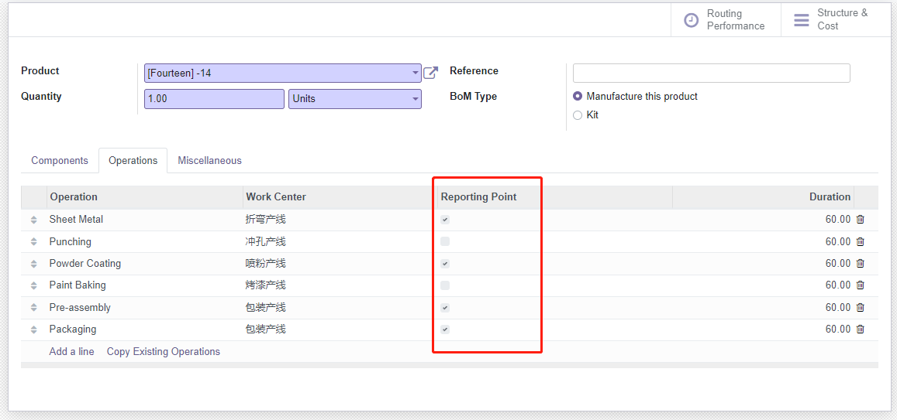
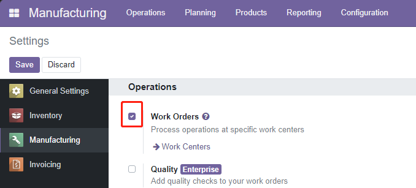

# Document Page

<!-- TOC -->
* [Document Page](#document-page)
    * [概述 / Overview](#概述--overview)
    * [特性介绍 / Feature Introduction](#特性介绍--feature-introduction)
      * [友好的报工界面 / User-Friendly Reporting Interface](#友好的报工界面--user-friendly-reporting-interface)
      * [精细记录加工过程 / Detailed Recording of Manufacturing Process](#精细记录加工过程--detailed-recording-of-manufacturing-process)
      * [支持并行工序 / Support for Parallel Process](#支持并行工序--support-for-parallel-process)
      * [可修正用时和加工数量 / Adjustable Processing Time and Quantity](#可修正用时和加工数量--adjustable-processing-time-and-quantity)
    * [安装要求 / Installation Requirements](#安装要求--installation-requirements)
    * [开发计划 / Development Plan](#开发计划--development-plan)
    * [Bug Tracker](#bug-tracker)
    * [Contributors & Maintainers](#contributors--maintainers)
<!-- TOC -->

> The original text is in Chinese, and the text is machine translated.
### 概述 / Overview
在工序报工管理中，我们需要准确记录每个工序的开始和结束时间，以及过站数量，以反映真实的产能情况。同时，我们还需要控制产品按照设定的流程进行生产。这样可以确保生产过程的准确性和效率。  
In the management of operation reporting, it is crucial to accurately record the start and end time of each 
operation, as well as the quantity processed at each station, in order to reflect the real production capacity.
Additionally, it is important to control the production process to ensure that products are manufactured 
according to the defined process. This ensures the accuracy and efficiency of the production process.

### 特性介绍 / Feature Introduction
#### 友好的报工界面 / User-Friendly Reporting Interface
按编码跟踪，可快速跳转至工单。只展示生产现场人员所关注的信息，简单的操作布局。
Track by Code for Quick Work Order Navigation. Display only the information relevant to production floor personnel's concerns, with a simple operational layout.  
  

worksheet  

#### 精细记录加工过程 / Detailed Recording of Manufacturing Process
记录每次加工的开完工时间，计划开工数和实际完工数。适配MRP模块本身的暂停、异常操作。  
Record the start and completion times for each manufacturing operation, planned start quantity, and actual completion quantity. Adapt to pauses and exceptions within the Manufacturing module itself.  

#### 支持并行工序 / Support for Parallel Process
每个工序的可开工数量会受到前一个报告点的完工数量的影响。  
可以根据业务需要调整报告点，控制关键工序的先后顺序。  
The startable quantity for each operation is influenced by the completion quantity of the previous reporting point.  
Reporting points can be adjusted according to business needs to control critical operations.  

#### 可修正用时和加工数量 / Adjustable Processing Time and Quantity
在报工结束后，您可以对开工时间、完工时间、开工数量和完工数量进行修改。这些修改将自动更新到工单信息以及关联的其他加工记录中。  
After reporting is completed, you can make modifications to start time, completion time, start quantity, and completion quantity. These changes will automatically update the work order information and related processing records.  

> 针对暂停后再开工的情况，系统会细致地记录多条报工记录之间的关系。这有助于准确地追踪和呈现工作流程中的变化。  
> For cases of resuming work after a pause, the system will meticulously record relationships between multiple reporting entries. This aids in accurately tracking and visualizing changes within the workflow.  
> 已完工的工单或记录不允许修改数量，但可以对用时进行修改。这样可以保证生产数据的准确性，同时允许对实际用时进行调整。  
> Completed work orders or records cannot have their quantities modified, but their processing time can be adjusted. This ensures the accuracy of production data while allowing adjustments to actual processing time.

### 安装要求 / Installation Requirements
在使用本插件之前，请确保已经事先安装并启用了MRP模块和工单功能。  
Before using this plugin, make sure you have installed and activated the Manufacturing module and Work Order functionality.  

### 开发计划 / Development Plan

- [x] 过程报工 / Operation Process Reporting
- [ ] 生产质量控制 / Production Quality Management
- [ ] 登记设备模具 / Register Equipment Molds
- [ ] 工单序列号 / WorkOrder Serial Number
- [ ] 序列号报工 / Serial Number Reporting

### Bug Tracker
Bugs are tracked on [GitHub Issues](https://github.com/fenglander/leas_mes_process_reporting/issues)  
If you encounter an issue, please check here to see if your problem has already been reported.  
If you are the first to discover the issue, please help us resolve it by providing detailed information.

### Contributors & Maintainers

*  Fung

